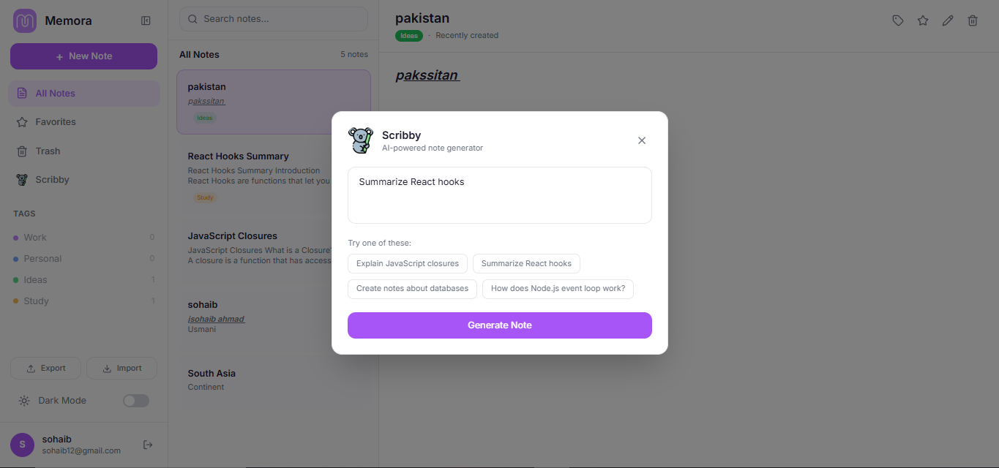
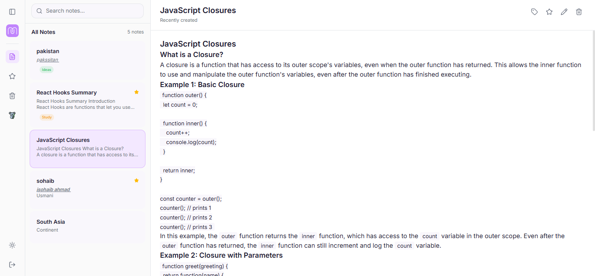

# Memora — AI-Powered Notes App

A full-stack MERN notes application with AI-powered note generation, rich text editing, and a premium UI with dark mode.


---

## Screenshots

| Dashboard | Scribby AI | Sidebar |
|-----------|-----------|---------|
|  |  |  |

### SonarQube Quality Gate


---

## Features

- **JWT Authentication** — Secure signup/login with token-based session management
- **Rich Text Editor** — Format notes with React Quill (bold, italic, lists, headings)
- **AI Note Generator (Scribby)** — Generate notes from prompts using GROQ AI (groq/compound model)
- **Dark Mode** — Toggle with localStorage persistence
- **Favorites & Trash** — Mark notes as favorites or move to trash before permanent deletion
- **Tags** — Organize notes with Work, Personal, Ideas, and Study tags
- **Export/Import** — Download notes as JSON and import them back
- **Search & Filter** — Real-time search across titles and content
- **Responsive Design** — Works on desktop, tablet, and mobile
- **Smooth Animations** — Framer Motion transitions and hover effects
- **Toast Notifications** — Instant feedback for all CRUD operations
- **Loading Skeletons** — Placeholder UI while data loads
- **Empty States** — Friendly prompts when no notes exist
- **XSS Protection** — DOMPurify sanitization on rich text content
- **Structured Logging** — Pino logger for backend request/error tracking

---

## Tech Stack

| Layer | Technology |
|-------|-----------|
| **Frontend** | React 19, Vite 8, Tailwind CSS v4 |
| **Backend** | Node.js, Express.js 5 |
| **Database** | MongoDB, Mongoose 8 |
| **Authentication** | JWT, bcrypt |
| **Rich Text** | React Quill New |
| **AI Engine** | GROQ API (groq/compound) |
| **HTTP Client** | Axios |
| **Routing** | React Router 7 |
| **Animations** | Framer Motion 12 |
| **Icons** | Lucide React |
| **Notifications** | React Hot Toast |
| **Backend Testing** | Mocha 11, Chai 6, Sinon 22, Supertest 7 |
| **Frontend Testing** | Jest 30, React Testing Library |
| **Code Quality** | SonarQube Community Edition |
| **Logging** | Pino |

---

## Getting Started

### Prerequisites

- **Node.js** (v18 or higher)
- **MongoDB** (local or Atlas)
- **npm** or **yarn**

### Installation

1. **Clone the repository**
   ```bash
   git clone https://github.com/SohaibAhmadUsmani/cohort-9-mern-15065-sohaib.git
   cd cohort-9-mern-15065-sohaib
   ```

2. **Backend setup**
   ```bash
   cd backend
   npm install
   ```

3. **Create `.env` file in `backend/`**
   ```env
   PORT=5000
   MONGODB_URI=mongodb://localhost:27017/notes
   JWT_SECRET=your_jwt_secret_here
   GROQ_API_KEY=your_groq_api_key_here
   ```

4. **Frontend setup**
   ```bash
   cd ../frontend
   npm install
   ```

5. **Start development servers**

   Terminal 1 — Backend:
   ```bash
   cd backend
   npm run dev
   ```

   Terminal 2 — Frontend:
   ```bash
   cd frontend
   npm run dev
   ```

6. **Open** [http://localhost:5173](http://localhost:5173)

---

## Testing

### Backend Tests (53 tests)

```bash
cd backend
npm test
```

Covers:
- Auth endpoints (signup, login, get user)
- Notes CRUD (create, read, update, delete)
- Authorization (user-scoped access)
- Error handling middleware

### Frontend Tests (198 tests)

```bash
cd frontend
npx jest --coverage
```

Covers:
- AuthContext & NotesContext providers
- Login, Signup, Dashboard pages
- Sidebar, NoteEditor, NoteModal, DeleteModal components
- Scribby AI generator
- API interceptors and services
- ProtectedRoute logic

### Coverage Summary

| Metric | Value |
|--------|-------|
| Statements | 92.12% |
| Branches | 77.52% |
| Functions | 94.80% |
| Lines | 94.46% |

### SonarQube Quality Gate

| Metric | Result | Threshold |
|--------|--------|-----------|
| New Coverage | 85.1% | >= 80% |
| New Violations | 0 | 0 |
| Duplicated Lines | 0.0% | < 3% |

---

## Project Structure

```
cohort-9-mern-15065-sohaib/
├── backend/
│   ├── src/
│   │   ├── config/           # db.js, logger.js
│   │   ├── controllers/      # authController, noteController, aiController
│   │   ├── middleware/        # authMiddleware, errorHandler
│   │   ├── models/           # User, Note schemas
│   │   ├── routes/           # authRoutes, noteRoutes, aiRoutes
│   │   ├── services/         # noteService
│   │   ├── app.js            # Express app
│   │   └── server.js         # DB connect + listen
│   ├── test/                 # Mocha/Chai tests
│   ├── .env
│   └── package.json
├── frontend/
│   ├── public/               # MemoraLogo.png, koala.png
│   ├── src/
│   │   ├── components/       # Sidebar, NoteEditor, NoteModal, DeleteModal, etc.
│   │   ├── context/          # AuthContext, NotesContext
│   │   ├── pages/            # Dashboard, Login, Signup
│   │   ├── services/         # api.js (axios), noteService.js
│   │   ├── __tests__/        # 15 test files (198 tests)
│   │   ├── App.jsx
│   │   └── main.jsx
│   ├── jest.config.cjs
│   └── package.json
├── pictures/                 # Screenshots
├── sonar-project.properties
└── README.md
```

---

## API Endpoints

### Auth

| Method | Endpoint | Description | Auth |
|--------|----------|-------------|------|
| POST | `/api/auth/signup` | Register new user | No |
| POST | `/api/auth/login` | Login user | No |
| GET | `/api/auth/me` | Get current user | Yes |

### Notes

| Method | Endpoint | Description | Auth |
|--------|----------|-------------|------|
| GET | `/api/notes` | Get all notes | Yes |
| GET | `/api/notes/:id` | Get single note | Yes |
| POST | `/api/notes` | Create note | Yes |
| PUT | `/api/notes/:id` | Update note | Yes |
| DELETE | `/api/notes/:id` | Delete note | Yes |

### AI

| Method | Endpoint | Description | Auth |
|--------|----------|-------------|------|
| POST | `/api/ai/generate` | Generate note with AI | Yes |

---

## Pull Requests

| PR | Branch | Description | Status |
|----|--------|-------------|--------|
| #1 | `feature/backend-setup` | Project scaffolding, DB, models | Merged |
| #2 | `feature/backend-auth` | JWT authentication | Merged |
| #3 | `feature/backend-notes` | Notes CRUD API | Merged |
| #4 | `feature/frontend-auth` | Login/Signup UI | Merged |
| #5 | `feature/frontend-notes` | Notes UI | Merged |
| #6 | `feature/frontend-ui-enhancement` | Memora UI polish | Merged |
| #7 | `feature/ai-note-generator` | Scribby AI feature | Merged |
| #8 | `feature/testing` | Backend tests | Merged |
| #9 | `feature/frontend-testing` | Frontend tests | Merged |
| #10 | `feature/sonarqube` | SonarQube quality gate | Merged |

---

## Author

**Sohaib Ahmad Usmani**
- GitHub: [SohaibAhmadUsmani](https://github.com/SohaibAhmadUsmani)

---

## License

This project is part of the MERN Stack Cohort 9 assignment.
